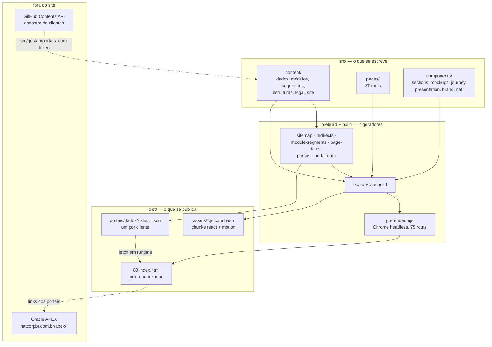
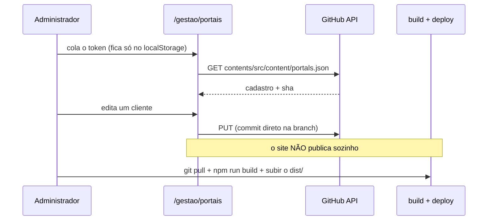

# Mapa do codebase

> Gerado pelo Cartographer com sete subagentes em paralelo. Último mapeamento: 2026-09-22.
> 456 arquivos, ~1,1M tokens. 109 commits, todos entre 05/09 e 21/09/2026.

Site institucional da **Natcorp** (HR-tech): SPA React 19 + TypeScript + Vite + Tailwind,
**pré-renderizada em HTML estático** e publicada na Vercel. 80 páginas HTML no `dist/`.

O que este site **não** é: o produto. O sistema que os clientes da Natcorp operam roda em
**Oracle APEX**, em outro servidor. Este repositório é o site de marketing **mais** as
portas de entrada (`/portais/<cliente>`) que levam ao APEX.

---

## Visão geral



---

## Estrutura de diretórios

```
natcorp-landing/
├── src/                       647k tokens · o aplicativo
│   ├── App.tsx                roteamento (27 rotas) + Shell (decide cabeçalho/rodapé)
│   ├── main.tsx               bootstrap; analytics DEPOIS do render
│   ├── content/               DADOS, separados da apresentação
│   │   ├── site.ts            paths + siteConfig — a fonte de verdade das URLs
│   │   ├── portals.ts         tipos e funções PURAS (não conhece a lista de clientes)
│   │   ├── portals.json       o cadastro (fonte; nunca vai para o pacote)
│   │   ├── clientPortals.json 2º cadastro, só do gerador legado (ver Armadilhas)
│   │   ├── modulePages/       31 módulos: registry.json + <slug>.ts + types + icons
│   │   ├── segments/          9 segmentos, mesmo padrão
│   │   ├── structures/        5 estruturas, mesmo padrão + chooser de 3 perguntas
│   │   └── legal/             3 documentos como árvore de blocos tipados
│   ├── pages/                 117k · 27 páginas de rota
│   ├── components/
│   │   ├── sections/          31 seções reutilizáveis + Navbar + Footer + CookieBar
│   │   ├── mockups/           21 telas falsas do produto (HTML/SVG, dados fictícios)
│   │   ├── journey/           22 · a jornada da contratação, 24 etapas encenadas
│   │   ├── presentation/      15 · o deck comercial, com exportação PDF/PPTX
│   │   ├── brand/             12 · logotipo, símbolo e as 4 peças de motion
│   │   ├── nati/ platform/ structure/ hero/ docs/ security/
│   │   ├── motion/            14 primitivos de animação sobre motion/react
│   │   └── ui/                10 wrappers shadcn/Radix
│   ├── lib/                   9 · analytics, consent, leads, markdown, GitHub API
│   └── hooks/                 7 · useSeo, usePortalClient, media queries
├── scripts/                   63k · 7 geradores de build + 6 ferramentas manuais
├── public/                    ativos + artefatos gerados (sitemap, redirects, portais/)
├── redirects/                 as mesmas regras 301 em Apache/Nginx/IIS
├── agent/skills/              17 skills genéricas de UX — NÃO é código do site
├── brand/                     material de marca + a máscara CSS do Oracle APEX
└── filme/ material-interno/   380 MB, no .gitignore, fora do repositório
```

---

## Guia por módulo

### `src/App.tsx` — roteamento e casca

**Entrada**: `main.tsx` → `App` → `MotionProvider` → `IntroProvider` → `Router` → `Shell` → `AppRoutes`.
`BrowserRouter`, ou `HashRouter` quando `VITE_ROUTER=hash` (prévias fora da raiz de domínio).

**27 rotas.** `LandingPage` é a **única** eager; todas as outras são `lazy()` sob `Suspense`.
`ModulePage` é pré-carregada 1,2 s após o primeiro render e no hover do mega-menu.

| grupo | rotas |
|---|---|
| marketing | `/` `/sistema` `/seguranca` `/sobre` `/contato` `/portais` `/perguntas-frequentes` `/modelo-comercial` `/implantacao` `/jornada-da-contratacao` |
| catálogos | `/modulos` `/modulos/:slug` · `/segmentos` `/segmentos/:slug` · `/estruturas` `/estruturas/:slug` |
| legal | `/privacidade` `/termos-de-uso` `/politica-de-cookies` |
| funcionais | `/portais/:cliente` · `/portais/dev/:cliente` · `/gestao/portais` (+ `/admin/portais`) · `/hospedagem` |
| internas | `/apresentacao` `/apresentacao/reduzida` `/motion` `/animatic` |
| redirect | `/grupos` → `/estruturas` · `*` → 404 |

**`Shell` decide a casca por `pathname`:**
- *chromeless* (`/apresentacao*`, `/animatic`) — sem `SmoothScroll` nem `ScrollProgress`.
- *hub* (`/portais/*`, `/gestao/*`, `/admin/*`, `/hospedagem`) — sem `Navbar` nem `Footer`; essas páginas têm cabeçalho próprio.
- `CookieBar` aparece em **tudo**, menos `/animatic`.

Os dois `useMatch` de `/portais` são chamados incondicionalmente e combinados com `??` — encadear violaria a regra de hooks. Está comentado no código.

### `src/content/` — a camada de dados

As três famílias de catálogo (módulos, segmentos, estruturas) seguem **o mesmo padrão**:

```
<família>/
  types.ts        o schema TypeScript
  index.ts        registry tipado + loader + path builder
  registry.json   lista leve (slug, nome, ícone, resumo) — vai no pacote inicial
  <slug>.ts       conteúdo completo — carregado sob demanda, um chunk por item
```

| família | itens | rota |
|---|---|---|
| módulos | **31**, em 7 grupos | `/modulos/<slug>` |
| segmentos | **9** | `/segmentos/<slug>` |
| estruturas | **5** (union literal fechada) | `/estruturas/<slug>` |
| legal | 3 constantes nomeadas, sem registry | rota fixa por documento |

Os 7 grupos de módulo: `pessoal-e-folha` (7) · `ponto-e-jornada` (2) · `saude-e-seguranca` (2) ·
`talentos` (5) · `desenvolvimento` (4) · `autoatendimento` (6) · `dados-ia-plataforma` (5).

Três módulos têm página React própria (`nati`, `natponto`, `people-analytics`), carregada por
`ModulePage` conforme o slug — a bifurcação é de **apresentação**, não de schema.

Os documentos legais não são markdown: são uma **árvore de blocos tipados**
(`p` `ul` `h3` `note` `contact` `table` `consent`) que `LegalPage.tsx` interpreta.

### `src/pages/` — 27 rotas

**Marketing**: Landing, About, System, Security, Commercial, Implantation, Contact, Faq,
Portals, os três índices e os três templates de catálogo, HiringJourney, Legal (×3), NotFound.

**Funcionais, não são marketing**:

| página | o que é |
|---|---|
| `PortalHubPage` | a porta de entrada do cliente no sistema real |
| `PortalAdminPage` | CRUD do cadastro, grava no GitHub com token do administrador |
| `HostingDocsPage` | documentação técnica para a equipe de hospedagem |
| `PresentationPage` | o deck comercial em tela cheia |
| `MotionPage` | QA interno das peças de marca |
| `AnimaticPage` | **temporária** — storyboard do filme, para fotografar quadro a quadro |

### `src/components/` — apresentação

**`sections/Section.tsx` é o sistema de layout de todo o site.** `Section` (4 tons:
`white` `off` `dark` `gradient`) decide o espaçamento vertical centralmente
(`py-20 sm:py-24 lg:py-32`, ou nada com `flush`); `SectionHeader` monta eyebrow + título
animado + lead. Nenhuma seção define o próprio padding na raiz.

**`mockups/`** desenha o produto em **HTML + SVG inline**, sem screenshot, sem canvas de
imagem, sem biblioteca de gráfico. Dados 100% fictícios e embutidos no próprio arquivo.
Os de `analytics/` são a exceção: reproduzem literalmente a UI do APEX em produção.

**`journey/`** encena 24 etapas da contratação de uma candidata fictícia. `scenes/` tem um
palco de dimensão fixa (960×540) escalado por `transform`, e registro automático por
`import.meta.glob('./Etapa*Scene.tsx')` — o nome do arquivo **é** a chave.

**`presentation/`** é o deck: ~31 slides, scroll-snap, atalhos de teclado, e exportação
PDF/PPTX **inteiramente no navegador** — fotografa cada slide com `html-to-image`, redesenha
num canvas 1920×1080 e monta com `jspdf`/`pptxgenjs`. É captura de tela: o texto não sai
editável no PowerPoint (as notas, sim).

**`brand/logo-paths.ts`** é a fonte geométrica única do símbolo. É importado por `Logo`,
`HeroSymbol`, `HumanModule` e pelas quatro peças de motion — mudar a geometria ali propaga
para o site inteiro.

### `scripts/` — a cadeia de build

```
npm run build
├── prebuild
│   1. limpa .DS_Store de public/
│   2. generate-sitemap      registries        → public/sitemap.xml, robots.txt
│   3. generate-redirects    legacyRedirects.ts → _redirects, _headers, .htaccess,
│                                                 vercel.json, redirects/*  (124 regras 301)
│   4. generate-module-segments segments/*.ts  → modulePages/segments.json (relação invertida)
│   5. generate-page-dates    git log          → pageDates.json (data real, não a do build)
│   6. build-portais          clientPortals.json → portais-standalone/  (FORA da entrega)
│   7. build-portal-data      portals.json     → public/portais/dados/<slug>.json + logos
├── tsc -b        valida tipos, não emite
├── vite build    empacota src/ + copia public/ → dist/
└── prerender.mjs abre as 75 rotas em Chrome headless e salva o DOM renderizado
```

**Ferramentas manuais**, fora do build: `build-hospedagem` (gera o `HOSPEDAGEM.html`
autônomo), `export-presentation` (PDF do deck via Playwright), `module-art/build.cjs`
(ícones e ilustrações dos 31 módulos), `medir-figuras.py`, `recorta.py`,
`journey-scene-to-jpg.cjs`.

---

## Fluxos

### Como o conteúdo chega à tela

```mermaid
sequenceDiagram
    participant V as Visitante
    participant H as dist/&lt;rota&gt;/index.html
    participant R as React
    participant C as chunk do item

    V->>H: GET /modulos/folha-de-pagamento
    H-->>V: HTML JÁ RENDERIZADO (title, OG, conteúdo)
    Note over V,H: quem não roda JS para aqui — e já tem tudo
    H->>R: hidrata
    R->>R: lê registry.json (já no pacote)
    R->>C: import() dinâmico do <slug>.ts
    C-->>R: conteúdo completo
    R-->>V: página interativa
```

Três estados em `ModulePage`/`SegmentPage`/`StructurePage`: `undefined` = carregando
(skeleton), `null` = não existe (404), valor = conteúdo. **Isto não é rede** — é
code-splitting; o chunk foi compilado junto do site.

### A porta de entrada do cliente — o único fetch real

```mermaid
sequenceDiagram
    participant C as Colaborador
    participant P as PortalHubPage
    participant J as /portais/dados/&lt;slug&gt;.json
    participant A as Oracle APEX

    C->>P: GET /portais/stefanini
    P->>P: slugValido? ^[a-z0-9][a-z0-9-]{0,63}$
    P-->>C: estado "carregando" (tela neutra, sem nome)
    P->>J: fetch
    alt arquivo existe e é JSON
        J-->>P: só ESTE cliente
        P-->>C: portais contratados
        C->>A: clica → apex/hcm/f?p=PO_STEFANINI
    else 404, ou index.html devolvido pelo fallback
        P-->>C: "não encontramos" — sem listar ninguém
    end
```

### A administração do cadastro



---

## Convenções

**Conteúdo separado da apresentação.** Componente não carrega texto; `src/content/*` carrega.
Um arquivo `.ts` por item, nome do arquivo = slug.

**`[[destaque]]`** nas taglines: `SplitText` colore o trecho entre colchetes duplos.

**Ícones vêm de dicionários fechados** (`moduleIcons`, `segmentIcons`, `structureIcons`),
nunca import direto do `lucide-react` dentro do conteúdo.

**Animação**: `motion/react`, com dois padrões — entrada por scroll (`whileInView` +
`viewportOnce`) e timeline coreografada por tempo absoluto (as peças de marca e as cenas da
jornada). `useReducedMotion()` é tratado em toda peça. Easing padrão `EASE = [0.22,1,0.36,1]`,
definido uma vez em `lib/motion.ts`.

**Nada anima `opacity` a partir de 0.** Só `y`/`x`/`scale`. Está comentado em `lib/motion.ts`:
o site é pré-renderizado, o Chrome headless nunca rola até abaixo da dobra, e um `opacity:0`
congelaria no HTML salvo — entregando títulos invisíveis a quem lê HTML cru.

**Nunca `transition-all`** — sempre a lista explícita de propriedades.

**`.on-dark`** não pinta nada: marca o contexto para o `:focus-visible` virar branco.

**Comentários de cabeçalho longos, em português, explicando o porquê** de decisões não
óbvias. É a convenção mais forte do projeto — e a mais útil: quase toda armadilha abaixo foi
encontrada lendo um comentário, não o código.

**Acessibilidade**: peça decorativa leva `aria-hidden` e o texto real vai em paralelo
(`sr-only` ou `aria-label`).

---

## Armadilhas

### Segurança

1. **Nenhum arquivo publicado pode conter a LISTA de clientes.** Até 21/09/2026 o
   `Footer.tsx` importava `hubPath` — uma função de uma linha — de `@/content/portals`, esse
   módulo fazia `import portals.json`, e como o rodapé está em toda página o empacotador
   levava os sete clientes (nome, código, servidor APEX, URLs) para o pacote principal.
   **Uma função pura no mesmo módulo que os dados publica os dados.** Hoje `portals.ts` só
   tem tipos e funções puras. **Um `import portals.json` novo em qualquer módulo que o app
   carregue desfaz tudo isso em silêncio — o build não reclama.** Conferir depois de mexer:

   ```bash
   grep -rlE 'slug:`[a-z]+`,name:`[^`]+`,code:`' dist/assets/*.js   # tem de dar vazio
   ```

2. **Os logotipos vazavam pelo nome do arquivo.** O `import.meta.glob` antigo escrevia
   `realfood.png`, `redeflex.png`, `stefanini.png` dentro do pacote. Agora são copiados para
   `public/portais/logos/` e referidos por URL, que só aparece no JSON do próprio dono.

3. **O 404 do hub não pode imprimir nome de cliente.** Ele já listou todos, um botão cada.

### Cadastros e geradores

4. **Existem DOIS cadastros de clientes paralelos.** `portals.json` alimenta o site atual;
   `clientPortals.json` alimenta só `build-portais.mjs`, que gera `portais-standalone/` —
   ignorado pelo git, rotulado pelo próprio script como *"fora da entrega"*, **não entra no
   `dist/`**. Não é vazamento, e não é arquivo órfão: é um segundo sistema. Editar um cliente
   num e não no outro deixa os dois divergentes sem aviso.

5. **Nunca editar artefato gerado à mão** — todos trazem o aviso no cabeçalho:
   `sitemap.xml`, `robots.txt`, `_redirects`, `_headers`, `.htaccess`, `htaccess.txt`,
   `vercel.json` (chave `redirects`), `redirects/*`, `segments.json`, `pageDates.json`,
   `portais/dados/*`, `portais/logos/*`. O próximo build sobrescreve.

6. **Rodar o build local suja o git.** Todos esses artefatos são versionados, e `lastmod` do
   sitemap e `pageDates.json` mudam a cada execução. Revisar o `git diff` antes de commitar.

7. **A ordem dentro do `prebuild` é obrigatória.** `generate-redirects` lê o `sitemap.xml`
   para validar que todo destino existe — invertê-los derruba o build. `build-portal-data`
   precisa rodar antes do `vite build`, porque escreve em `public/`.

### Build e publicação

8. **Chrome é dependência de build não declarada.** `prerender.mjs` procura caminhos fixos ou
   `CHROME_PATH`, e aborta sem ele. Não está no `package.json` — é ambiente.

9. **`vite preview` NÃO serve para conferir o build.** Ele não resolve
   `<caminho>/index.html` e devolve sempre a home, mascarando um build quebrado. A hospedagem
   precisa resolver: arquivo real → `<rota>/index.html` → fallback SPA.

10. **Uma rota que falhe derruba o build inteiro**, de propósito — "falhar é melhor que
    publicar um site meio pré-renderizado". Uma página lenta no CI quebra o deploy.

11. **`/admin/portais` não responde em produção**: o WAF devolve 403 para qualquer
    `/admin/*`. O endereço válido é `/gestao/portais`; a rota antiga fica caso o WAF mude.

### Conteúdo

12. **Três pontos de verdade para o slug** — nome do arquivo, `slug` no `registry.json`,
    `slug` dentro do `.ts` — e o TypeScript não checa nenhum contra o outro. Só o nome do
    arquivo é usado pelo loader.

13. **Adicionar um item exige dois arquivos.** Sem a linha no `registry.json`, o `.ts` existe
    e nunca aparece: nem no sitemap, nem no prerender, nem em listagem alguma.

14. **`moduleNotes` tem de cobrir os 31 módulos**, não só os do `spotlight`. Falta de chave
    renderiza `undefined` em silêncio.

15. **Slug errado falha calado quase sempre** (`.filter(Boolean)`). A única combinação que
    derruba o build é módulo citado em segmento, via `generate-module-segments`.

16. **`segments.json` é gerado por regex sobre o texto-fonte** dos segmentos. Reformatar um
    `spotlight: [...]` pode quebrar o parser sem erro de TypeScript.

17. **`politica-de-cookies.ts` descreve o comportamento de `lib/consent.ts`.** Mudar o código
    sem atualizar o texto deixa a declaração legal errada, sem checagem automática.

18. **Datas fictícias envelhecem**: os mockups do NatPonto têm data fixa no texto
    ("03/09/2026 18:36").

### Documentação defasada

19. **`README.md` e `HOSPEDAGEM.md` estão atrás do código.** O README documenta
    `/portais_beta/<cliente>` e `/admin/portais` como ativos, e aponta `clientPortals.json`
    como fonte do hub. O `HOSPEDAGEM.md` descreve o build em 4 passos e **não menciona o
    prerender** — grave, porque o resto do documento assume que as rotas não existem como
    arquivo em disco, o que hoje é falso. Corrigir antes de entregar a uma equipe externa.

---

## Guia de navegação

**Adicionar um módulo** → `src/content/modulePages/<slug>.ts` (schema em `types.ts`) +
linha em `registry.json` + ícone em `icons.ts` se for novo. O sitemap, o prerender e as
listagens seguem sozinhos. Rodar `npm run build`.

**Adicionar um segmento ou estrutura** → idem, em `segments/` ou `structures/`. Em segmento,
o `moduleNotes` precisa cobrir os 31 módulos, e um slug de módulo errado **derruba o build**.

**Mexer numa página de marketing** → `src/pages/<X>Page.tsx` e as seções em
`src/components/sections/`. O texto costuma estar embutido na página; só os catálogos vivem
em `src/content/`.

**Mexer no cadastro de clientes** → pela tela `/gestao/portais`, com token do GitHub. Nunca
editar `portals.json` à mão sem lembrar do `clientPortals.json` paralelo. Depois:
`npm run build` e subir o `dist/` — **o site não publica sozinho**.

**Mexer na porta de entrada do cliente** → `src/pages/PortalHubPage.tsx`,
`src/hooks/usePortalClient.ts`, `src/content/portals.ts`, `scripts/build-portal-data.mjs`.
Depois, conferir o `grep` da armadilha 1 e abrir as 7 portas num navegador.

**Adicionar um redirecionamento** → só `src/content/legacyRedirects.ts`. Os cinco formatos
saem do `npm run redirects`.

**Mexer no layout de todas as páginas** → `src/components/sections/Section.tsx` (espaçamento
e tons) e `src/index.css` (tokens). O gradiente e as cores da marca ficam no
`tailwind.config.js`, sob `brand.*`.

**Mexer na animação** → `src/lib/motion.ts` para os tokens; `src/components/motion/` para os
primitivos. Lembrar: **nada anima `opacity` a partir de 0**.

**Mexer no símbolo da marca** → `src/components/brand/logo-paths.ts`, e só ali. Conferir
depois o `HeroSymbol` (os trilhos de luz derivam da geometria à mão).

**Mexer no deck comercial** → `src/components/presentation/slides/index.ts` define a
sequência; `short: true` marca o que entra na versão reduzida. A ordem do array **é** a ordem.

**Publicar** → `npm run build` (precisa de Chrome) e subir `dist/`. A hospedagem tem de
resolver `<rota>/index.html` antes do fallback. Detalhe em `HOSPEDAGEM.md` — que está
defasado, ver armadilha 19.

---

## Diretórios que não são o site

**`agent/skills/`** — 17 skills genéricas de UX/produto (`intent` é o roteador; `articulate`,
`evaluate`, `wireframe`, `journey`...). Nenhuma menciona Natcorp. Rastreadas pelo git, sem
relação com o build.

**`brand/`** — material de marca. `brand/apex/` documenta uma **máscara de CSS** para
modernizar o sistema Oracle APEX do cliente sem tocar em template, página ou JavaScript
(restrição do cliente: um único arquivo CSS, rollback em uma linha). `brand/apex/APEX Style/`
são 26 MB de páginas do APEX salvas do ambiente do cliente — ignorado pelo git.
**Único acoplamento com o site**: `brand/modulos/ilustracoes/svg/*.svg` é copiado por
`build-portais.mjs`. Cuidado com o homônimo: `src/components/brand/` é outra coisa.

**`filme/` e `material-interno/`** — 380 MB no `.gitignore`. O filme institucional (cenas,
prompts, chapas 4K, vídeos) vive só em disco. É por isso que esse trabalho não aparece no
histórico do git.
